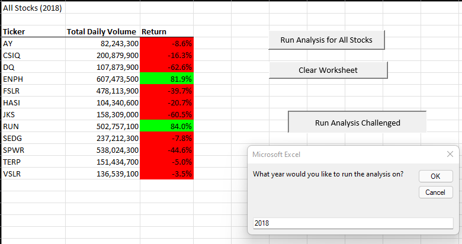

# Stock Analysis
Module 2 Stock Analysis

## Overview of Project: 
There is data for volumes with the names of tickers and we are trying to see how each ticker performed in 2017 and 2018. 
The attached images will help visualize their performance levels. 

## Stock Volumes by Ticker from 2017

## Stock Volumes by Ticker from 2018

##### My Short Analysis:
As you can see by the colors, the return percentages show that they did better in 2017 but there is so many reds showing negative percentages in 2018. 

##### What are the advantages or disadvantages of refactoring code?
Advantages: You can make the code clean and organized and it helps find bugs and the programming faster.
Disadvantages: It might take longer time than you planned.

##### How do these pros and cons apply to refactoring the original VBA script?
It could be more difficult as you might want to keep fixing your codes to work. 

## my codes
Sub AllStocksAnalysisChallenged()

    'Need to make variables for run time
    Dim startTime As Single
    Dim endTime As Single
    
    
    yearValue = InputBox("What year would you like to run the analysis on?")
    startTime = Timer

    Worksheets("All Stocks Analysis").Activate

    Range("A1").Value = "All Stocks (" + yearValue + ")"
    
    
    
    'Create a header row
    Cells(3, 1).Value = "Ticker"
    Cells(3, 2).Value = "Total Daily Volume"
    Cells(3, 3).Value = "Return"
    
    
    
    Dim tickers(12) As String

    tickers(0) = "AY"
    tickers(1) = "CSIQ"
    tickers(2) = "DQ"
    tickers(3) = "ENPH"
    tickers(4) = "FSLR"
    tickers(5) = "HASI"
    tickers(6) = "JKS"
    tickers(7) = "RUN"
    tickers(8) = "SEDG"
    tickers(9) = "SPWR"
    tickers(10) = "TERP"
    tickers(11) = "VSLR"

    Worksheets(yearValue).Activate

    'get the number of rows to loop over
    RowCount = Cells(Rows.Count, "A").End(xlUp).Row
    
    tickerIndex = 0
    
    Dim tickerVolumes(12) As Long
    Dim tickerStartingPrices(12) As Single
    Dim tickerEndingPrices(12) As Single

    For i = 0 To 11

        
        tickerVolumes(i) = 0
        
    Next i
    
    
        Worksheets(yearValue).Activate
        For i = 2 To RowCount
    
            tickerVolumes(tickerIndex) = tickerVolumes(tickerIndex) + Cells(i, 8).Value
                   
        
            
            If Cells(i - 1, 1).Value <> tickers(tickerIndex) And Cells(i, 1).Value = tickers(tickerIndex) Then

                tickerStartingPrices(tickerIndex) = Cells(i, 6).Value

            End If

            If Cells(i + 1, 1).Value <> tickers(tickerIndex) And Cells(i, 1).Value = tickers(tickerIndex) Then

                tickerEndingPrices(tickerIndex) = Cells(i, 6).Value
                tickerIndex = tickerIndex + 1

            End If

        Next i
        
       
        For i = 0 To 11
            Worksheets("All Stocks Analysis").Activate
            Cells(4 + i, 1).Value = tickers(i)
            Cells(4 + i, 2).Value = tickerVolumes(i)
            Cells(4 + i, 3).Value = tickerEndingPrices(i) / tickerStartingPrices(i) - 1
        

        Next i
  
 'Formatting for my results
 
    Worksheets("All Stocks Analysis").Activate
    Range("A3:C3").Font.FontStyle = "Bold"
    Range("A3:C3").Borders(xlEdgeBottom).LineStyle = xlContinuous
    Range("B4:B15").NumberFormat = "#,##0"
    Range("C4:C15").NumberFormat = "0.0%"
    Columns("B").AutoFit
    dataRowStart = 4
    dataRowEnd = 15
    For i = dataRowStart To dataRowEnd

        If Cells(i, 3) > 0 Then

            Cells(i, 3).Interior.Color = vbGreen

        Else

            Cells(i, 3).Interior.Color = vbRed

        End If

    Next i

End Sub
