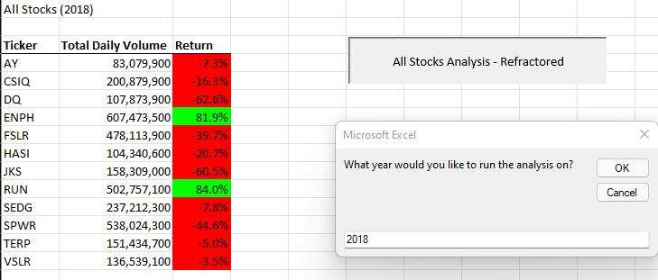

# Stock Analysis
Module 2 Stock Analysis

## Overview of Project: 
There is data for volumes with the names of tickers and we are trying to see how each ticker performed in 2017 and 2018. 
The attached images will help visualize their performance levels. 

## Stock Volumes by Ticker from 2017

## Stock Volumes by Ticker from 2018

##### Short analysis:
As you can see by the colors, the return percentages show that they did better in 2017 but there is so many reds showing negative percentages in 2018. 

##### What are the advantages or disadvantages of refactoring code?
Advantages: You can make the code clean and organized and it helps find bugs and the programming faster
Disadvantages: It might take longer time than you planned 

##### How do these pros and cons apply to refactoring the original VBA script?
